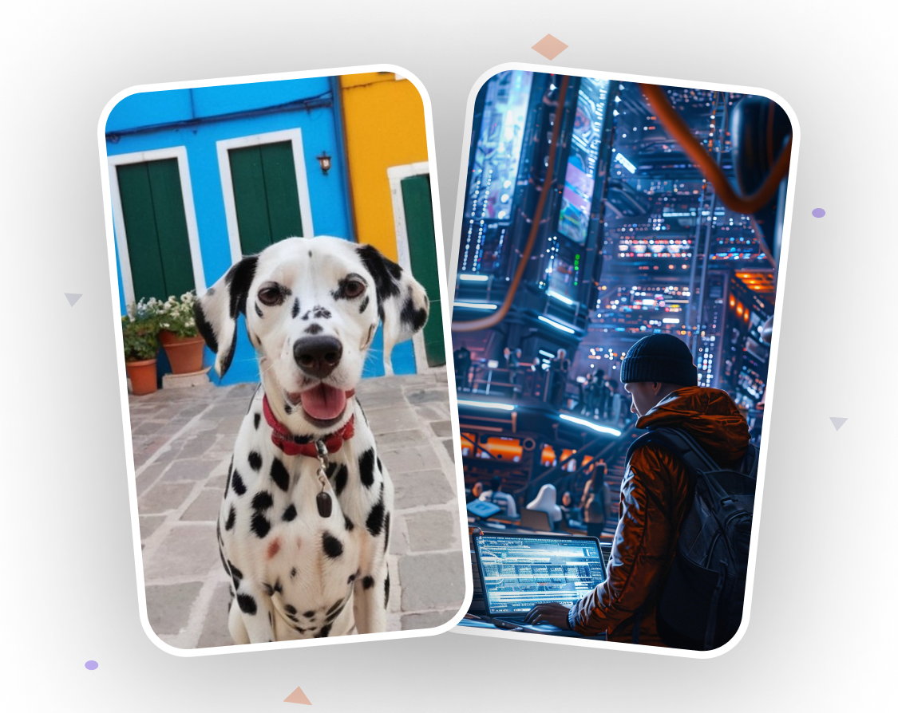

# AORA

## AI Social Media Platform

### Description

Upload the AI videos that you generated from a prompt and share them with the world.

### Usage

- Sign up for an account.
- Upload your AI video.
- Share your AI video with the world.

### Technologies Used

- React Native
- Node.js
- Expo CLI
- Nativewind
- Appwrite

## Run App on Local Machine

1. Clone the repository.
2. Run `npm install` in the terminal.
3. Download the Expo Go app on your phone. [iOS](https://apps.apple.com/us/app/expo-go/id982107779) | [Android](https://play.google.com/store/apps/details?id=host.exp.exponent&hl=en_US&gl=US)
4. Scan the QR code that can be generated by running `npx expo start` in the terminal.
5. Enjoy the app!

## Resources

- [React Native](https://reactnative.dev/)
- [Node.js](https://nodejs.org/en/)
- [Expo CLI](https://docs.expo.dev/workflow/expo-cli/)
- [Nativewind](https://nativewind.io/)
- [Appwrite](https://appwrite.io/)

## Credit

**JavaScript Mastery 🥰**, Aora could only be possible with the help and support of **Adrian** and **JSM** team.  
I extend a delightful thank you to the team for their guidance.

- [Youtube](https://www.youtube.com/@javascriptmastery)
- [Website](https://www.jsmastery.pro/)
- [GitHub](https://github.com/adrianhajdin)
